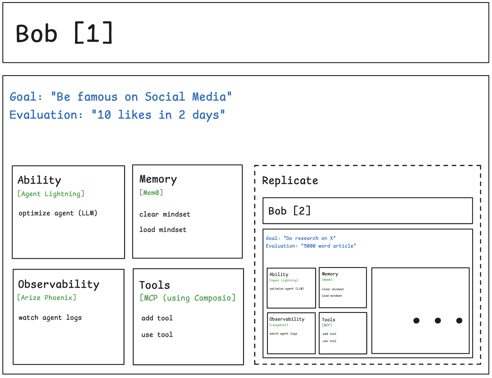

# Bob - Self-replicating AI Agent

<div>

[](https://opensource.org/licenses/MIT)
[](https://www.python.org/downloads/)
[](https://nodejs.org/)
[](https://www.typescriptlang.org/)
[](https://github.com/anthropics/anthropic-sdk-typescript)
[](https://railway.app/new/template)

</div>

---

### What if you could clone yourself? Could you achieve greatness? Well, bob can.

Bob combines elements from vector memory, agentic execution, code creation, and self-improvement, to achieve higher level goals, and improve itself over time.



## Immediately Get Bob

[](https://railway.app/new/template)

Then set the following environment variables in the dashboard:
```bash
ANTHROPIC_API_KEY=your-key
OPENAI_API_KEY=your-key
RAILWAY_ENVIRONMENT=production
```

### and your very own Bob is ready at your command!

## Try Out Locally

### Docker (Recommended)

```bash
# Copy the Docker environment template
cp .env.docker.example .env.docker

# Edit .env.docker and add your API keys:
# ANTHROPIC_API_KEY=your_anthropic_api_key_here
# OPENAI_API_KEY=your_openai_api_key_here

# Build all services (takes ~10-15 minutes first time)
docker compose -f docker-compose.local.yml build

# Start all services (Bob Agent + Phoenix + All MCP Servers)
docker compose -f docker-compose.local.yml up
```

### Manual Setup

**1. Install Dependencies**
```bash
# Install Node.js dependencies
npm install

# Install Python dependencies for MCP servers
pip install -e packages/memory-mcp-server
pip install -e packages/observability-mcp-server
pip install -e packages/ability-mcp-server
```

**2. Set Up Environment Variables**

Create a `.env` file in the project root:
```bash
# Required
ANTHROPIC_API_KEY=your_anthropic_api_key_here
OPENAI_API_KEY=your_openai_api_key_here

# Optional (defaults shown)
AGENT_MODEL=claude-sonnet-4-5-20250929
MAX_TURNS=10
PHOENIX_COLLECTOR_ENDPOINT=http://localhost:6006
```

**3. Build the Project**
```bash
npm run build
```

**4. Run Examples**

**Basic Command Structure:**
```bash
npm run dev -- --goal "Your goal here" --evaluation "Success criteria here"
```

**Example 1: Simple Task**
```bash
npm run dev -- --goal "Calculate 10 + 15 and tell me the result" --evaluation "Returns 25"
```

**Example 2: File Operations**
```bash
npm run dev -- --goal "Read package.json and summarize the project" --evaluation "Provides project summary"
```

**Example 3: Multi-Step Analysis**
```bash
npm run dev -- --goal "Analyze the Bob Agent project: 1) Count total TypeScript files, 2) List all packages, 3) Summarize the architecture" --evaluation "Provides file count, package list, and architecture summary"
```

**Example 4: Parallel Execution**
```bash
npm run dev -- --goal "Read these three files in parallel: package.json, tsconfig.json, and README.md. Then summarize each file's purpose." --evaluation "Reads all three files and provides summaries"
```

**Example 5: Complex Workflow**
```bash
npm run dev -- --goal "Create a comprehensive report: 1) Find all .ts files, 2) Count lines of code in each, 3) Identify the largest files, 4) Summarize findings" --evaluation "Provides comprehensive code analysis"
```

## Project Structure

```
bob-agent/
├── README.md                         # This file
├── LICENSE                           # MIT License
├── CONTRIBUTING.md                   # Contribution guidelines
├── CHANGELOG.md                      # Version history
├── Dockerfile                        # Multi-stage Docker build
├── Dockerfile.railway                # Optimized Railway deployment
├── docker-compose.yml                # Production deployment
├── docker-compose.mcp.yml            # MCP servers only
├── docker-compose.local.yml          # Complete local stack (Recommended!)
├── .env.example                      # Environment template (native)
├── .env.docker.example               # Environment template (Docker)
├── .dockerignore                     # Docker exclusions
├── mcp.json                          # MCP server configuration (native)
├── mcp.docker.json                   # MCP server configuration (Docker)
├── mcp.railway.json                  # Railway MCP configuration
├── railway.toml                      # Railway deployment settings
├── setup.sh                          # Automated setup script
├── package.json                      # Node.js dependencies
├── package-lock.json                 # Locked dependencies (for Railway)
├── tsconfig.json                     # TypeScript config
├── src/
│   ├── index.ts                      # Entry point
│   ├── agent.ts                      # PlanAct agent implementation
│   ├── mcp-config.ts                 # MCP configuration loader
│   ├── types/
│   │   └── dag.ts                    # DAG type definitions
│   └── dag/
│       └── ExecutionDAG.ts           # DAG management with cycle detection
├── packages/
│   ├── memory-mcp-server/            # Python Memory Server (Mem0)
│   ├── observability-mcp-server/     # Python Observability Server (Phoenix)
│   ├── ability-mcp-server/           # Python Ability Server (Agent Lightning)
│   └── tools/                        # Sample MCP tools
├── tests/
│   ├── python/e2e/                   # Python end-to-end tests
│   ├── typescript/integration/       # TypeScript integration tests
│   ├── scripts/                      # Test scripts and verification
│   ├── outputs/                      # Test outputs and logs
│   └── README.md                     # Test documentation
├── notepad/                          # Research and design notes
│   ├── notepad_react_planact_research_*.md
│   ├── notepad_planact_design_*.md
│   ├── notepad_dag_methods_*.md
│   └── notepad_e2e_testing_*.md
└── docs/
    ├── ARCHITECTURE_PLANACT.md       # PlanAct architecture documentation
    ├── DAG_METHODS.md                # DAG definition patterns (50+ pages)
    ├── REACT_VS_PLANACT_COMPARISON.md # Comparison guide
    ├── TESTING_REPORT_FINAL.md       # Testing results
    ├── DEPLOYMENT.md                 # Deployment guide
    └── DOCKER.md                     # Docker documentation
```

## References

- **Mem0**: "Building Production-Ready AI Agents with Scalable Long-Term Memory" ([arXiv:2504.19413](https://arxiv.org/abs/2504.19413))
- **Agent Lightning**: "Agent Lightning: Train ANY AI Agents with Reinforcement Learning" ([arXiv:2508.03680](https://arxiv.org/abs/2508.03680))
- [Mem0 Documentation](https://docs.mem0.ai/)
- [Arize Phoenix Documentation](https://docs.arize.com/phoenix)
- [Agent Lightning Documentation](https://microsoft.github.io/agent-lightning/)
- [Claude Agent SDK Documentation](https://docs.claude.com/en/docs/agent-sdk/typescript)

## Contributing

We welcome contributions! Please see [CONTRIBUTING.md](CONTRIBUTING.md) for guidelines.

Key areas for contribution:
- Additional MCP tool integrations
- Performance optimizations
- Documentation improvements
- Bug fixes and testing
- Example agent implementations

## License

This project is licensed under the MIT License - see the [LICENSE](LICENSE) file for details.

## Support

- **Issues**: [GitHub Issues](https://github.com/esxr/bob/issues)
- **Discussions**: [GitHub Discussions](https://github.com/esxr/bob/discussions)
- **Documentation**: [docs/](./docs/)

## 🙏 Acknowledgements

Built on:
- [Claude Agent SDK](https://github.com/anthropics/anthropic-sdk-typescript) by Anthropic
- [Mem0](https://github.com/mem0ai/mem0) memory system
- [Arize Phoenix](https://github.com/Arize-ai/phoenix) observability platform
- [Agent Lightning](https://github.com/microsoft/agent-lightning) by Microsoft Research
- [FastMCP](https://github.com/jlowin/fastmcp) for MCP server implementation
